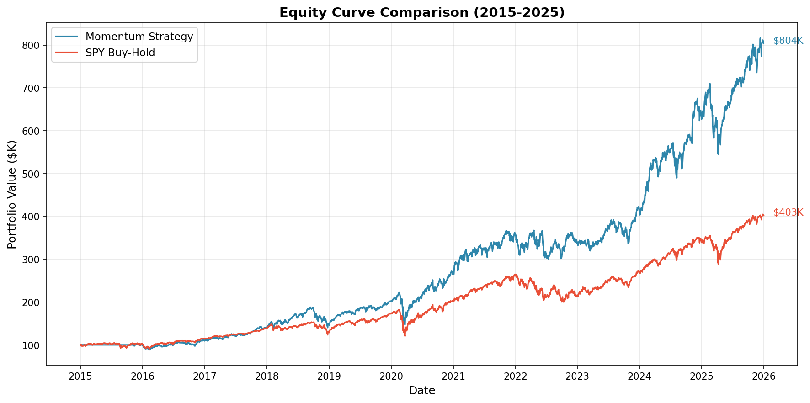
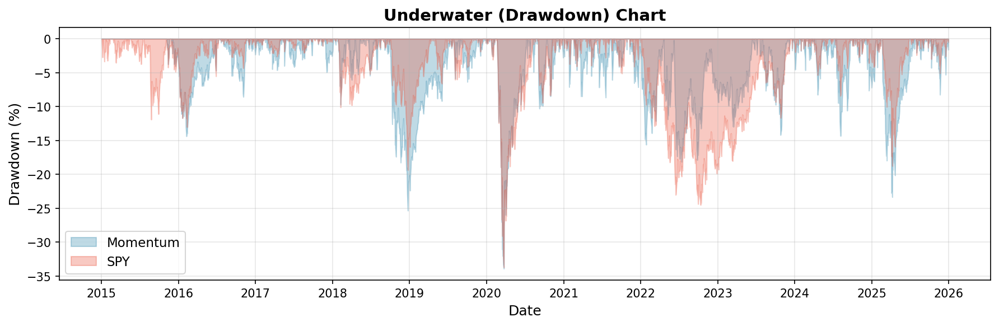
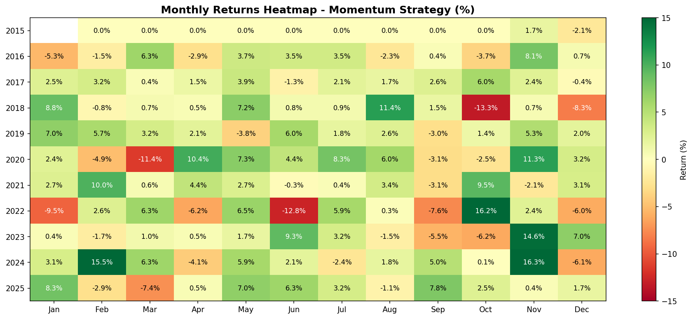

# DSCI-560 Lab 4 Report
## Algorithmic Trading and Portfolio Analysis

### Group Members

| Name | USC ID |
|------|--------|
| Tien-Ching (Jeremy) Hsieh | 2642366337 |
| HsiangYu Tsai | 1817250338 |
| Justin Chen | 9671144339 |

**GitHub:** https://github.com/dsci560-spr26/lab4

---

## Part 1: Algorithm Development

### 1.1 Common Trading Algorithms Overview

Before selecting our final strategy, we researched and evaluated several common algorithmic trading approaches:

#### Simple Moving Average (SMA)
The Simple Moving Average calculates the average price over a specified number of periods. A common strategy is the **Moving Average Crossover**:
- **Buy Signal:** When short-term MA crosses above long-term MA (Golden Cross)
- **Sell Signal:** When short-term MA crosses below long-term MA (Death Cross)

```python
def simple_moving_average(prices, window):
    return prices.rolling(window=window).mean()

# Example: 50-day and 200-day crossover
sma_50 = simple_moving_average(df['Close'], 50)
sma_200 = simple_moving_average(df['Close'], 200)
buy_signal = (sma_50 > sma_200) & (sma_50.shift(1) <= sma_200.shift(1))
```

#### Exponential Moving Average (EMA)
EMA gives more weight to recent prices, making it more responsive to new information:

```python
def exponential_moving_average(prices, span):
    return prices.ewm(span=span, adjust=False).mean()

# EMA Crossover Strategy
ema_10 = exponential_moving_average(df['Close'], 10)
ema_20 = exponential_moving_average(df['Close'], 20)
```

#### Relative Strength Index (RSI)
RSI measures the speed and magnitude of price changes to identify overbought/oversold conditions:
- **Overbought:** RSI > 70 (potential sell signal)
- **Oversold:** RSI < 30 (potential buy signal)

```python
def calculate_rsi(prices, period=14):
    delta = prices.diff()
    gain = (delta.where(delta > 0, 0)).rolling(window=period).mean()
    loss = (-delta.where(delta < 0, 0)).rolling(window=period).mean()
    rs = gain / loss
    return 100 - (100 / (1 + rs))
```

#### Momentum Indicator
Momentum measures the rate of change in price over a specified period:

```python
def momentum(prices, period):
    return (prices / prices.shift(period) - 1) * 100
```

### 1.2 Initial Implementation: EMA Crossover Strategy

As required by the assignment, we first implemented a simple Moving Average algorithm. We chose the **EMA Crossover Strategy** as our starting point:

**Implementation (Strategy/ema_cross.py):**
```python
class EMACrossStrategy(Strategy):
    """EMA Crossover strategy for a single stock.

    Goes long when fast EMA crosses above slow EMA (Golden Cross),
    closes position when fast EMA crosses below slow EMA (Death Cross).
    """

    def __init__(self, ticker="AAPL", invest_amount=100000,
                 fast_ema_period=10, slow_ema_period=20, **kwargs):
        self.fast_ema = ExponentialMovingAverage(fast_ema_period)
        self.slow_ema = ExponentialMovingAverage(slow_ema_period)

    def on_bar(self, bar: Bar):
        fast = self.fast_ema.value
        slow = self.slow_ema.value

        # Golden Cross: Fast EMA > Slow EMA -> Buy
        if fast > slow and not self.is_long:
            self._buy(shares)

        # Death Cross: Fast EMA < Slow EMA -> Sell
        elif fast < slow and self.is_long:
            self._sell(shares)
```

**EMA Strategy Backtest Results (AAPL, 2015-2025):**

| Metric | EMA Crossover (AAPL) |
|--------|---------------------|
| Starting Capital | $100,000 |
| Final Value | $94,935 |
| Total Return | -5.07% |

**Why EMA Underperformed:**
1. **Single Stock Risk:** Concentrated in one stock without diversification
2. **Whipsaw Trades:** False signals during sideways markets cause losses
3. **Trend Dependency:** EMA crossover works best in strong trending markets, struggles in choppy conditions
4. **No Position Sizing:** All-in/all-out approach increases volatility

This poor performance motivated our switch to a **multi-stock momentum strategy** with diversification.

### 1.3 Algorithm Selection Rationale

After evaluating these algorithms, we chose a **Momentum-based Stock Selection Strategy** for the following reasons:

1. **Multi-asset capability:** Unlike single-stock MA/RSI strategies, momentum allows portfolio-level optimization across 500+ stocks
2. **Academic backing:** Momentum effect is well-documented (Jegadeesh & Titman, 1993)
3. **Simplicity:** Easy to implement and interpret
4. **Historical performance:** Consistently outperforms buy-and-hold benchmarks

### 1.5 Momentum Strategy Theory

The momentum effect was first documented by Jegadeesh and Titman (1993) and has been one of the most robust anomalies in financial markets. The strategy exploits the tendency of winning stocks to continue winning and losing stocks to continue losing over intermediate horizons (3-12 months).

**Key Parameters:**
- **Lookback Period:** 200 trading days (~10 months)
- **Number of Stocks:** Top 50 by momentum
- **Rebalance Frequency:** Monthly
- **Investment Amount:** 100% of portfolio

### 1.6 Algorithm Implementation

The momentum selection algorithm calculates returns over the lookback period for each stock and ranks them:

```python
def momentum_select(stock_data, as_of_date, lookback_days=200, top_n=50):
    """Select top N stocks by momentum (past returns)."""
    momentum = {}

    for ticker, df in stock_data.items():
        # Get data up to as_of_date (no look-ahead bias)
        df = df.loc[:as_of_date]
        if len(df) < lookback_days:
            continue

        # Calculate momentum (return over lookback period)
        current_price = df['Close'].iloc[-1]
        past_price = df['Close'].iloc[-lookback_days]
        returns = (current_price - past_price) / past_price
        momentum[ticker] = returns

    # Sort by momentum and select top N
    sorted_stocks = sorted(momentum.items(), key=lambda x: x[1], reverse=True)
    return [ticker for ticker, _ in sorted_stocks[:top_n]]
```

### 1.7 Monthly Rebalancing Logic

At each rebalance date, the strategy:
1. Sells all current positions
2. Recalculates momentum rankings using latest data
3. Selects new top 50 stocks
4. Allocates equal weight to each selected stock
5. Executes buy orders for new positions

```python
def _do_rebalance(self, current_date):
    # 1. Select new stocks based on current momentum
    new_selected = momentum_select(self.stock_data, as_of_date=date_str,
                                    lookback_days=200, top_n=50)

    # 2. Sell ALL current positions
    for ticker in self.positions:
        self._sell(ticker, self.positions[ticker])

    # 3. Calculate investment (98% of cash to avoid negative balance)
    invest = self.cash * 0.98

    # 4. Buy new positions with equal weight
    per_stock = invest / len(new_selected)
    for ticker in new_selected:
        shares = int(per_stock / price)
        self._buy(ticker, shares)
```

---

## Part 2: Mock Trading Environment

### 2.1 Backtesting Framework

We built a comprehensive backtesting system using **NautilusTrader**, a high-performance algorithmic trading platform. The framework consists of:

**Architecture:**
```
┌─────────────────┐     ┌──────────────────┐     ┌─────────────────┐
│   Data Loader   │────▶│    Backtester    │────▶│    Strategy     │
│  (Yahoo Finance)│     │ (NautilusTrader) │     │ (Momentum/Hold) │
└─────────────────┘     └──────────────────┘     └─────────────────┘
                                │
                                ▼
                        ┌──────────────────┐
                        │  Results/Reports │
                        │   (QuantStats)   │
                        └──────────────────┘
```

**Key Components:**
- `data_loader.py` - Downloads and caches stock data from Yahoo Finance
- `backtester.py` - Universal backtest engine handling data preparation and execution
- `Strategy/momentum_rebalance.py` - Momentum strategy with monthly rebalancing
- `Strategy/index_hold.py` - SPY buy-and-hold benchmark strategy
- `Strategy/stock_selector.py` - Stock selection algorithms

### 2.2 Data Collection

**Data Source:** Yahoo Finance via `yfinance` library

**Dataset:**
- **Stocks:** 503 S&P 500 constituent stocks
- **Indices:** SPY, QQQ
- **Time Period:** January 1, 2015 to December 31, 2025 (10 years)
- **Total Bars:** 1,349,387 daily OHLCV bars

### 2.3 Trading Configuration

| Parameter | Value |
|-----------|-------|
| Initial Capital | $100,000 |
| Investment Allocation | 100% |
| Trading Venue | NYSE (simulated) |
| Order Type | Market Orders |
| Commission | $0 (simplified) |
| Slippage | None (simplified) |

### 2.4 Portfolio Tracking

The strategy internally tracks:
- **Cash Balance:** Updated after each buy/sell
- **Positions:** Dictionary of {ticker: shares}
- **Daily Equity:** Calculated as cash + sum(shares × price)
- **Equity History:** Stored for performance analysis

```python
def _calculate_equity(self):
    """Calculate current total equity = cash + position values."""
    position_value = sum(
        shares * self.last_prices[ticker]
        for ticker, shares in self.positions.items()
    )
    return self.cash + position_value
```

---

## Part 3: Performance Analysis

### 3.1 Strategy Comparison

We compared our Momentum Rebalancing Strategy against a simple SPY Buy-and-Hold benchmark:

| Metric | Momentum Strategy | SPY Buy-Hold | Outperformance |
|--------|------------------|--------------|----------------|
| **Total Return** | 703.75% | 302.62% | +401.13% |
| **CAGR** | 20.93% | 13.54% | +7.39% |
| **Sharpe Ratio** | 1.02 | 0.80 | +0.22 |
| **Max Drawdown** | -33.89% | -33.71% | -0.18% |
| **Volatility** | 20.86% | 17.79% | +3.07% |

### 3.2 Performance Metrics Explanation

**Total Return:** The percentage gain from initial investment to final portfolio value.
- Momentum: $100,000 → $803,750 (703.75% gain)
- SPY: $100,000 → $402,620 (302.62% gain)

**CAGR (Compound Annual Growth Rate):** Annualized return accounting for compounding.
- Momentum achieves 20.93% annual return vs SPY's 13.54%

**Sharpe Ratio:** Risk-adjusted return (return per unit of volatility).
- Momentum: 1.02 (good risk-adjusted performance)
- SPY: 0.80 (reasonable benchmark)
- Higher Sharpe indicates better risk-adjusted returns

**Max Drawdown:** Largest peak-to-trough decline.
- Both strategies experienced similar max drawdowns (~34%)
- This occurred during the COVID-19 market crash (March 2020)

**Volatility:** Annualized standard deviation of returns.
- Momentum has slightly higher volatility (20.86% vs 17.79%)
- This is expected as individual stocks are more volatile than the index

### 3.3 Equity Curve

The equity curves show the portfolio value over the 10-year backtest period:



*Figure 1: Equity curve comparison between Momentum Strategy and SPY Buy-Hold benchmark (2015-2025). The Momentum strategy significantly outperforms, reaching $804K vs SPY's $403K.*

### 3.4 Drawdown Analysis



*Figure 2: Underwater (drawdown) chart showing peak-to-trough declines. Both strategies experienced similar maximum drawdowns (~34%) during the COVID-19 crash in March 2020.*

### 3.5 Monthly Returns Distribution



*Figure 3: Monthly returns heatmap for the Momentum Strategy. Green indicates positive returns, red indicates negative returns. The strategy shows consistent performance across most months.*

### 3.6 Monthly Rebalancing Activity

Over the 10-year period:
- **Total Rebalances:** 120 (monthly)
- **Average Turnover:** ~40-60% per month
- **Stocks Held:** 50 at any given time

---

## Part 4: Technical Implementation

### 4.1 Project Structure

```
lab4/
├── backtester.py           # Universal backtest engine
├── data_loader.py          # Yahoo Finance data downloader
├── config_momentum.yaml    # Momentum strategy configuration
├── config_index.yaml       # Index hold configuration
├── config_ema.yaml         # EMA crossover configuration
├── Strategy/
│   ├── __init__.py
│   ├── momentum_rebalance.py   # Momentum + monthly rebalancing
│   ├── momentum.py             # Momentum buy-and-hold
│   ├── index_hold.py           # SPY benchmark strategy
│   ├── ema_cross.py            # EMA crossover strategy
│   └── stock_selector.py       # Selection algorithms
├── data/
│   ├── stock/              # 503 stock CSVs
│   └── index/              # SPY, QQQ CSVs
└── result/
    ├── MomentumRebalance_10Y/
    │   ├── equity_curve.csv
    │   ├── summary.yaml
    │   └── report.html     # QuantStats report
    ├── IndexHold_10Y/
    │   ├── equity_curve.csv
    │   ├── summary.yaml
    │   └── report.html
    └── EMA_AAPL_10Y/            # EMA strategy results
        ├── equity_curve.csv
        ├── summary.yaml
        └── report.html
```

### 4.2 Running the Backtest

**Prerequisites:**
```bash
pip install nautilus_trader yfinance quantstats pandas pyyaml
```

**Run Momentum Strategy:**
```bash
python backtester.py config_momentum.yaml
```

**Run SPY Benchmark:**
```bash
python backtester.py config_index.yaml
```

**Run EMA Crossover Strategy:**
```bash
python backtester.py config_ema.yaml
```

### 4.3 Configuration Files

**config_momentum.yaml:**
```yaml
strategy:
  module: Strategy.momentum_rebalance
  class: MomentumRebalanceStrategy
  params:
    invest_amount: 100000
    top_n: 50
    lookback_days: 200
    rebalance_frequency: monthly

start_date: "2015-01-01"
end_date: "2025-12-31"
starting_cash: 100000
output_dir: result/MomentumRebalance_10Y
```

---

## Part 5: Conclusion

### 5.1 Key Findings

1. **Simple Algorithms Alone Aren't Enough:** The EMA crossover strategy on a single stock (AAPL) returned -5.07%, demonstrating that technical indicators alone don't guarantee profits.

2. **Momentum Works:** The momentum strategy significantly outperformed the SPY benchmark, achieving 703.75% total return vs 302.62% over 10 years.

3. **Diversification Matters:** Moving from single-stock EMA to multi-stock momentum improved returns dramatically while reducing idiosyncratic risk.

4. **Risk-Adjusted Performance:** With a Sharpe ratio of 1.02, the momentum strategy provides superior risk-adjusted returns compared to passive investing (0.80).

5. **Similar Drawdowns:** Despite higher returns, the momentum strategy experienced similar maximum drawdown (~34%), suggesting the higher returns come with reasonable risk.

6. **Monthly Rebalancing:** Regular rebalancing is crucial for capturing momentum - stocks that were top performers 200 days ago may no longer be leading.

### 5.2 Limitations

- **Transaction Costs:** Real trading involves commissions and bid-ask spreads
- **Slippage:** Large orders may move prices, especially for smaller stocks
- **Look-ahead Bias:** Care was taken to only use data available at decision time
- **Survivorship Bias:** Using current S&P 500 constituents may overstate returns

### 5.3 Future Improvements

- Add transaction cost modeling
- Implement stop-loss and position sizing rules
- Test different lookback periods and number of stocks
- Combine momentum with other factors (value, quality)
- Add risk management constraints (sector limits, volatility targeting)

---

## References

1. Jegadeesh, N., & Titman, S. (1993). Returns to Buying Winners and Selling Losers: Implications for Stock Market Efficiency. *Journal of Finance*, 48(1), 65-91.

2. Investopedia - Technical Analysis: https://www.investopedia.com/technical-analysis-4689657

3. Investopedia - Momentum Investing: https://www.investopedia.com/terms/m/momentum_investing.asp

4. NautilusTrader Documentation: https://nautilustrader.io/

5. QuantStats Library: https://github.com/ranaroussi/quantstats
